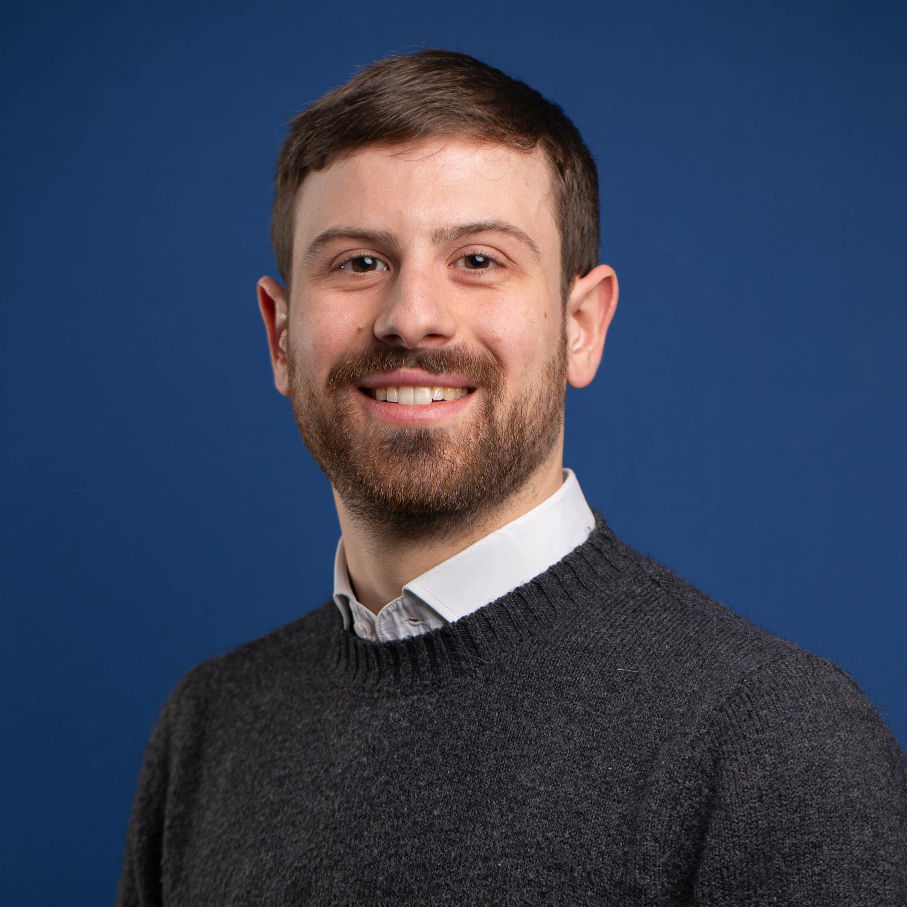

# Riccardo Bianchini

<figure>
    
</figure>

I am a researcher in computer science who just finished a research fellow at [DIBRIS](https://dibris.unige.it/en), [University of Genoa](https://unige.it/en).

## Research interests

My research interests are on the design of resource-aware programming languages. In particular, I am focused on the design of graded type systems and semantics.

## Research topics

- graded type systems
- graded operational semantics
- global types