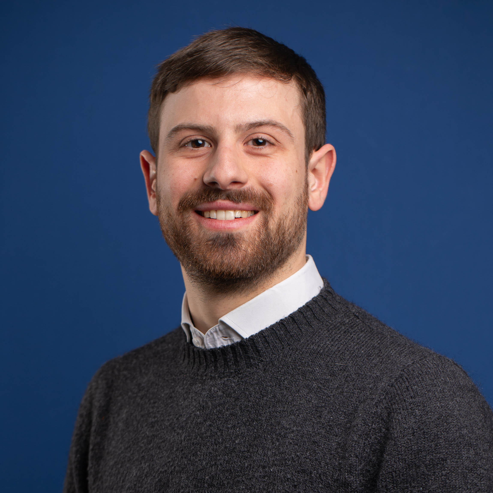

# Riccardo Bianchini

<figure>
    
</figure>

## Research interests

My research focuses on foundations of programming languages. In particular, I am interested in adding resource-awareness to programming languages by using graded types.

## Contacts

Department of Computer Science, Bioengineering, Robotics and System Engineering \\
Via Dodecaneso 35, Genoa, Italy \\
Room 309

email: [riccardobianchini2@outlook.it](mailto:riccardobianchini2@outlook.it)